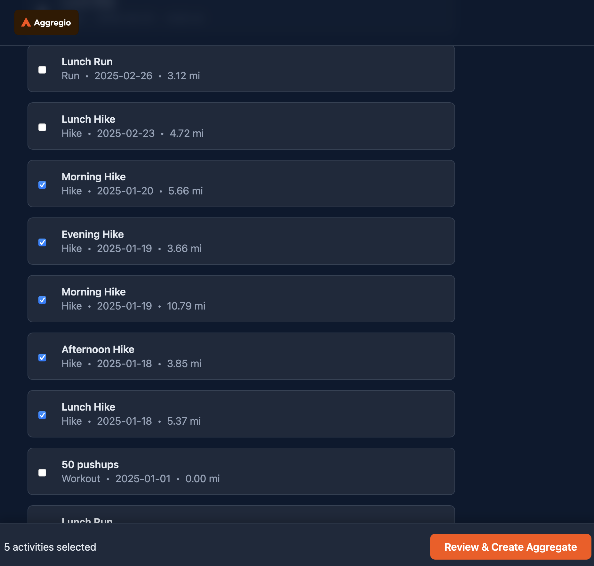
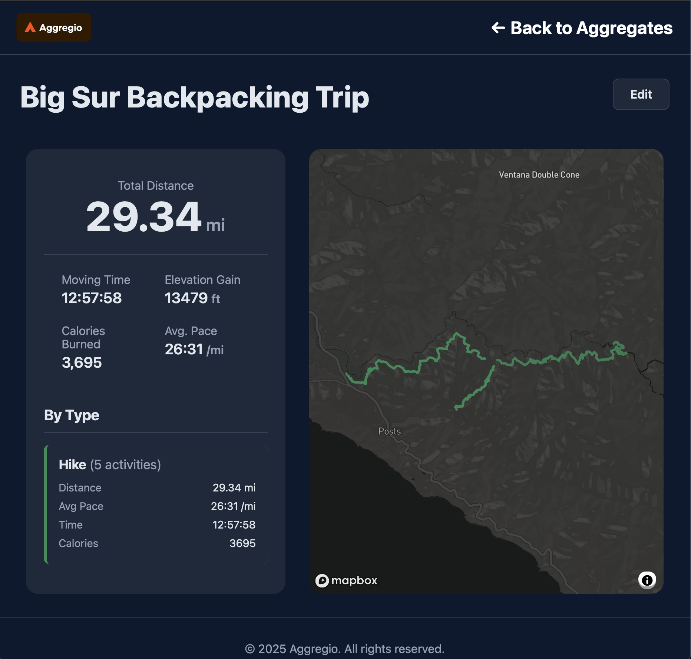

# Aggregio

--- By: Milo Powell ---

`Aggregio` allows you to aggregate multiple workouts on Strava to create one cohesive map

The application can be used at [here](https://aggregio.onrender.com).

# Contents

- [Why?](#why)
- [Example](#example)
- [Usage](#usage)

### Why?

---

Aggregio was created because of an issue I faced after going on a 3-day backpacking trip with my cousin. I had recorded multiple "hiking" workouts on my Apple Watch to my Strava, but I couldn't figure out a good way to view all the activities at once. Therefore, in order to view all the acitvities at once, I created Aggregio.

### Example

---

Here are screenshots showing you what you can expect from this application.

`Home page`

Here is the homepage

`Aggregate creation`

Here is the page to create aggregates

`Aggregate naming`

Here is the page to name your new aggregate

`Aggregate viewing`

Here is the page to view your aggregate

### Usage

---

Feel free to use the service for all your workout aggregating needs! Some ideas for usage include marathon training visualization, bike-packing journeys across the world, and swim workouts in the ocean.

